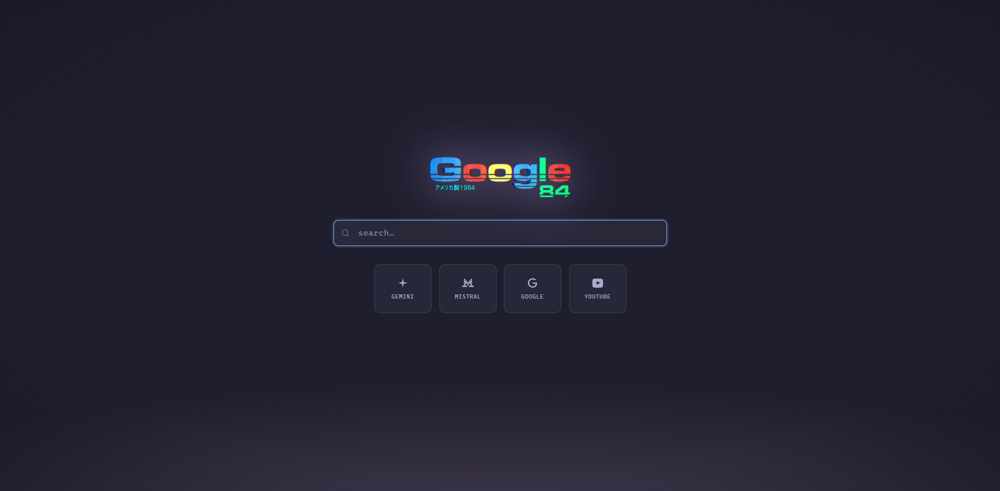
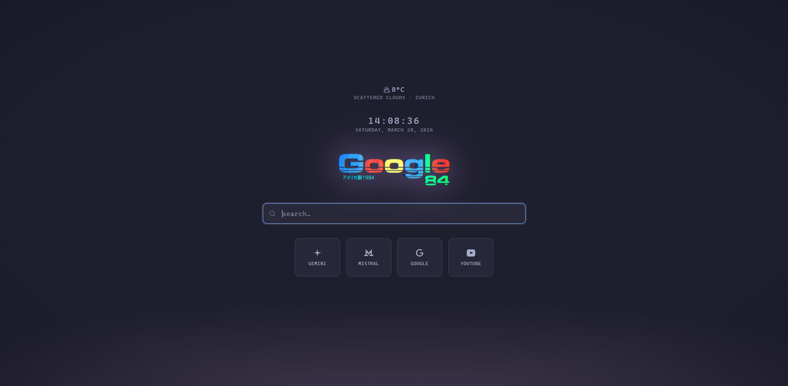

# 👾 Startpage '84

A zero-latency custom new-tab and home page for **LibreWolf** and **Firefox**.
Synthwave aesthetic with CRT effects · Catppuccin Mocha theme by default · fully configurable without touching HTML.

| Minimal | With clock & weather |
|:---:|:---:|
|  |  |

---

## ✨ Features

- ⚡ **Instant load** — served from `file://`, no network, no waiting
- 🔒 **Privacy-first** — no extensions, no telemetry, no external requests at startup
- 🎛️ **Config-driven** — swap themes, tiles, search engine, and weather in two small files
- 🌊 Glassmorphism search bar with live focus glow
- 🃏 Quick-link tiles with per-tile accent colours
- 🌟 Animated logo with neon glow pulse
- 📺 CRT scanlines + vignette background effects
- 🕐 Optional live clock and weather widget (OpenWeatherMap free tier)
- ⌨️ Any keypress refocuses the search bar

---

## 🛠️ Prerequisites

| Requirement | Details |
|---|---|
| LibreWolf or Firefox | Both are supported. LibreWolf is prioritised if both are installed. |
| Git | For cloning the repo |
| Bash | Linux/macOS: built-in. Windows: [Git Bash](https://git-scm.com/downloads) (run as Administrator) |
| `sudo` access | Linux/macOS only — needed to write to the browser's install directory |
| A [Nerd Font](https://www.nerdfonts.com) | Optional, but required for weather icons to render correctly |

> **Flatpak installs are not supported** by this script. The AutoConfig mechanism used here requires write access to the browser's install directory, which Flatpak sandboxes.

---

## 🚀 Installation

```bash
# 1. Clone
git clone https://github.com/your-username/synth-browser-startpage-newtab
cd synth-browser-startpage-newtab

# 2. Add your own logo (optional)
#    Drop a PNG with transparency into startpage/ and update logoSrc in config.js

# 3. Edit the config — at minimum set your weather API key or disable weather
#    (see Configuration section below)
#    startpage/config.js
#    startpage/config.css

# 4. Deploy
chmod +x deploy.sh
./deploy.sh

# 5. Restart your browser
```

`deploy.sh` automatically:
- Detects your OS (Linux, macOS, Windows)
- Finds your LibreWolf or Firefox install directory
- Copies the startpage files to `~/Documents/startpage/`
- Writes the AutoConfig files to the browser install directory
- On Arch Linux: installs a pacman hook that re-applies the config after browser updates

Re-running `./deploy.sh` is safe and can be used to push config changes at any time.

### Windows

Run Git Bash **as Administrator** (right-click → "Run as administrator"), then execute `./deploy.sh`.
The script uses `cygpath` to resolve paths — available in Git Bash, MSYS2, and Cygwin.

### Manual install / unsupported paths

If the script can't find your browser, set the path manually:

```bash
# Linux example
BROWSER_DIR=/usr/lib/firefox ./deploy.sh

# macOS example
BROWSER_DIR="/Applications/Firefox.app/Contents/Resources" ./deploy.sh
```

---

## ⚙️ Configuration

All customisation lives in two files inside `startpage/`. You never need to touch `index.html`.
After editing, re-run `./deploy.sh` — no browser restart needed for CSS/JS-only changes, just refresh the tab.

### `startpage/config.js` — Behaviour & Content

#### Search engine

```js
searchUrl: 'https://www.google.com/search?q=',    // Google (default)
searchUrl: 'https://duckduckgo.com/?q=',           // DuckDuckGo
searchUrl: 'https://search.brave.com/search?q=',  // Brave Search
searchUrl: 'http://localhost:8080/search?q=',      // SearXNG (self-hosted)
```

#### Quick-link tiles

Each entry in the `tiles` array:

```js
{
  name:   'GitHub',
  url:    'https://github.com',
  accent: 'var(--mauve)',   // any CSS colour or variable from config.css
  svg:    `<path d="..." fill="currentColor"/>`,  // SVG path, 24×24 viewBox
}
```

Icons: [lucide.dev](https://lucide.dev) · [simpleicons.org](https://simpleicons.org)
Colours: any CSS value, or a named variable such as `var(--teal)`, `var(--red)`, `var(--sapphire)`.

#### Clock

```js
showClock:      true,  // show live clock and date above the logo
clockFormat24h: true,  // false for 12-hour AM/PM
```

#### Weather

```js
showWeather:   true,
weatherApiKey: 'your_key_here',  // free at openweathermap.org → "Current Weather Data"
weatherUnits:  'metric',         // 'metric' (°C) or 'imperial' (°F)
weatherCity:   'Berlin',         // fallback city if geolocation is denied; leave '' to hide
```

The widget uses your browser's geolocation by default, falling back to `weatherCity` if permission is denied.
Weather icons require a [Nerd Font](https://www.nerdfonts.com) to be installed on your system.

You can customise which icon and colour is shown per condition group:

```js
weatherIcons: {
  thunderstorm: '\u{F0593}',   // swap any Nerd Font codepoint
  clearDay:     '\u{F0599}',
  // ...
},
weatherColors: {
  rain:        'var(--blue)',
  clearDayHot: 'var(--red)',
  // ...
},
weatherTempWarm: 22,  // °C threshold for 'warm' clear-sky colour
weatherTempHot:  30,  // °C threshold for 'hot' clear-sky colour
```

---

### `startpage/config.css` — Theme & Layout

#### 🎨 Colour themes

The file ships with **Catppuccin Mocha** active, plus commented-out blocks for **Tokyo Night** and **Gruvbox Dark**.
To switch, uncomment the desired block and comment out the Catppuccin section.

Other themes to port manually:

| Theme | Base | Accent |
|---|---|---|
| Nord | `#2e3440` | blues and teals |
| Dracula | `#282a36` | purple |
| Solarized Dark | `#002b36` | yellow |
| Rosé Pine | `#191724` | muted pink/gold |
| Everforest | `#2d353b` | warm greens |

#### Layout

| Variable | Default | Description |
|---|---|---|
| `--logo-width` | `270px` | Logo display width |
| `--card-width` | `110px` | Tile card width |
| `--card-height` | `94px` | Tile card height |
| `--border-radius-card` | `12px` | Tile corner radius |
| `--font-stack` | GeistMono → JetBrains Mono → monospace | Font family chain |

#### 📺 Visual effects

Set any of these to `transparent` to disable the effect:

| Variable | Description |
|---|---|
| `--scanline-color` | CRT scanline overlay |
| `--vignette-color` | Corner vignette |
| `--bg-glow-primary` | Synthwave sun glow (main colour) |
| `--bg-glow-secondary` | Synthwave sun glow (fade colour) |
| `--logo-glow-idle` | Logo drop-shadow at rest |
| `--logo-glow-peak` | Logo drop-shadow at float peak |

---

## 🔧 How it works

Browsers block extensions from setting a `file://` URL as the new-tab page.
This project bypasses that restriction using the browser's **AutoConfig** system:

```
<browser-install-dir>/
├── defaults/pref/autoconfig.js   ← tells the browser to load the config file on startup
└── librewolf.cfg                 ← overrides AboutNewTab.newTabURL + startup homepage pref
```

On **Arch Linux**, `deploy.sh` also installs a pacman hook that re-applies these files automatically after every browser package update (which would otherwise overwrite them).

---

## 🙌 Credits

This project was inspired by the *Google 84* vaporwave artwork by [@warakami_vaporwave](https://www.instagram.com/warakami_vaporwave/).
The image sparked the whole aesthetic direction — the synthwave palette, the glow effects, and the name.
The logo shipped in this repo (`startpage/logo.png`) is derived from that work; all credit goes to the original artist.

---

## 📁 File structure

```
synth-browser-startpage-newtab/
├── README.md
├── deploy.sh                    ← run this to install or update
│
├── startpage/                   ← the page itself
│   ├── index.html               ← layout and logic  (no need to edit)
│   ├── config.css               ← colours, sizes, effects   ← edit this
│   ├── config.js                ← tiles, search, weather    ← edit this
│   └── logo.png                 ← replace with your own
│
├── system/                      ← browser AutoConfig templates
│   ├── autoconfig.js
│   └── librewolf.cfg
│
└── pacman-hook/
    └── librewolf-startpage.hook ← Arch Linux: protects config from updates
```
